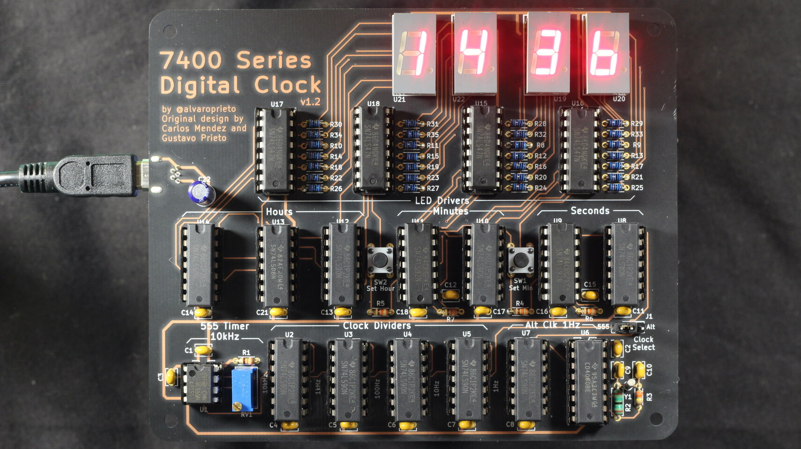
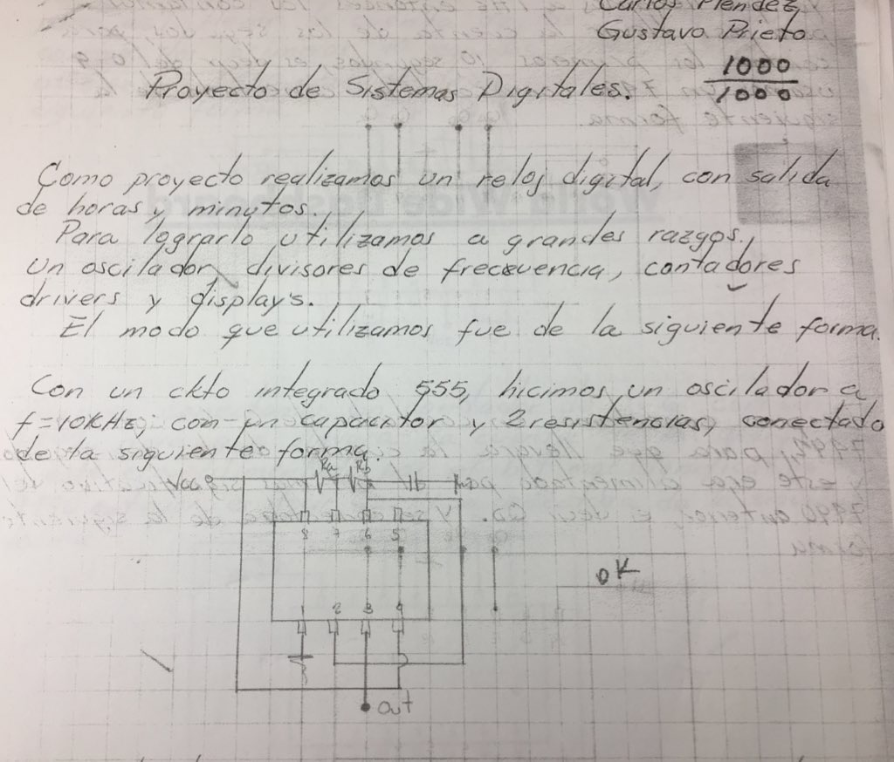
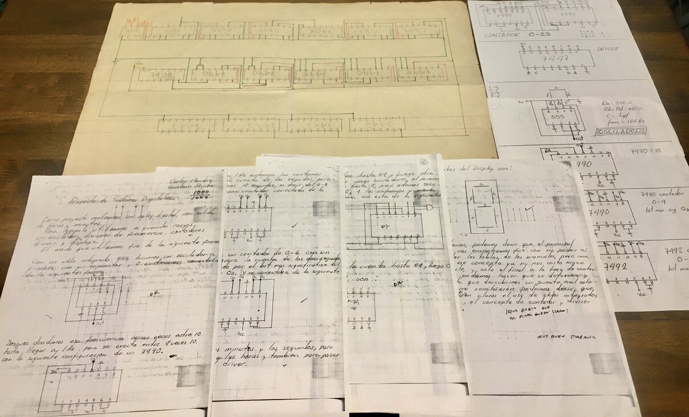

# Reloj - 7400 Series Digital Clock

This project was inspired by my dad's university digital systems project from the late 1970's. I found the writeup and schematic and decided to try and re-create it. You can see the results of the breadboard reproduction and explanations in [this twitter thread.](https://github.com/alvarop/reloj)

After a while, I figured it would be fun to make a soldering kit out of it, which resulted in this.

The design is fairly close to the original, but with the addition of a crystal-backed alternate clock source. The 555 timer cock source works, but drifts like crazy, so if you want to use it as an actual clock, you still can with the alt source.

If you want to take a look at the actual paper, you can see the scanned version [here](files/sistemas_digitales.pdf).

## Design Files
You can get the latest files in the [github releases](https://github.com/alvarop/reloj/releases).

For v1.2, you can use my [OSHPark shared project](https://oshpark.com/shared_projects/LdUSEX5V) or by grabbing the gerbers from the release.

## Assembly Instructions
You can find semi-detailed assembly instructions [here](INSTRUCTIONS.md).

